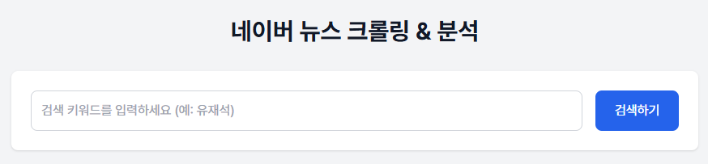
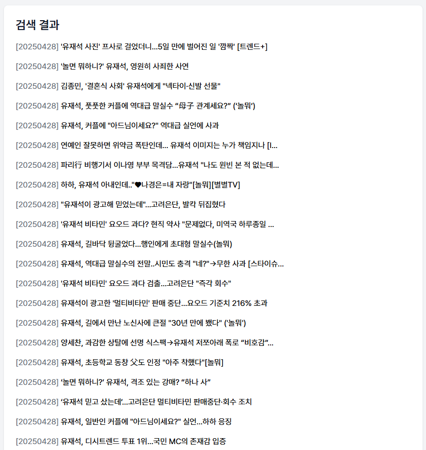
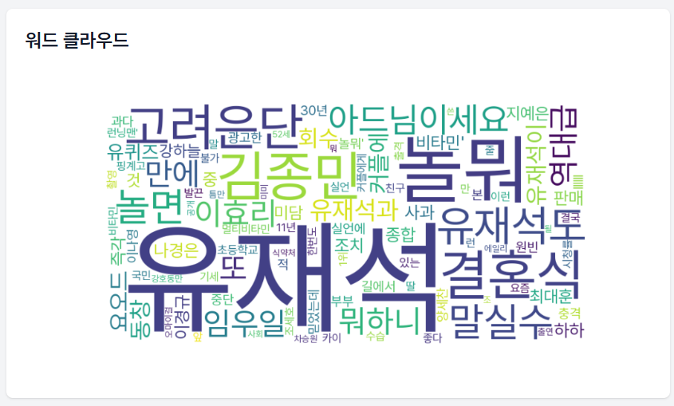
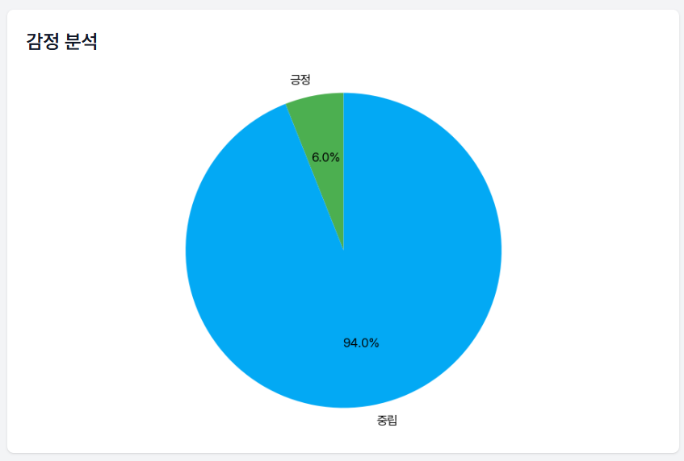

# 📰 네이버 뉴스 크롤러 & 분석기

## 📝 프로젝트 소개

이 프로젝트는 네이버 뉴스에서 특정 키워드와 관련된 최신 기사를 크롤링하여 수집하고, 이를 기반으로 키워드 분석(워드 클라우드)과 감정 분석을 수행하는 **파이썬 기반 웹 애플리케이션**입니다. 언론 보도의 트렌드를 빠르게 파악하거나 특정 주제에 대한 여론 경향을 시각적으로 확인하고 싶은 사용자(예: 마케터, 연구자, 저널리스트)에게 유용합니다.


## ✨ 주요 기능

- **뉴스 크롤링**: 네이버 뉴스에서 최근 n일간의 기사의 제목을 수집
- **워드 클라우드**: 수집된 기사의 키워드를 시각화
- **감정 분석**: 뉴스 기사의 긍정/부정/중립 성향 분석 및 파이 차트로 시각화
- **반응형 디자인**: 모바일과 데스크톱에서 모두 사용 가능한 UI


## 💻 주요 기능 코드 예시

### 🔍 1. 네이버 뉴스 크롤링
```python
url = f"https://search.naver.com/search.naver?where=news&query={keyword}&ds={date_str}&de={date_str}&start={start}"
response = requests.get(url, headers=headers, timeout=10)
soup = BeautifulSoup(response.text, 'html.parser')
articles = soup.select('.sds-comps-text.sds-comps-text-ellipsis-1.sds-comps-text-type-headline1')
```

### ☁️ 2. 워드 클라우드 생성
```python
wordcloud = WordCloud(
    width=800, height=400, background_color='white',
    font_path=FONT_PATH, max_words=100, collocations=False
).generate(text)
```

### 😀 3. 감정 분석
```python
analyzer = SentimentIntensityAnalyzer()
score = analyzer.polarity_scores(text)
if score['compound'] >= 0.05:
    return '긍정'
elif score['compound'] <= -0.05:
    return '부정'
else:
    return '중립'
```

## 🛠️ 기술 스택

<div align="center">
  
  
  
  
    
</div>


### 🧠 백엔드 (Backend)
- **Python**, **Flask**, **BeautifulSoup4**, **WordCloud**, **VADER Sentiment**, **Matplotlib**

### 🎨 프론트엔드 (Frontend)
- **HTML/CSS**, **JavaScript**, **Tailwind CSS**, **Pretendard 폰트**


## 🖼️ 스크린샷

- 🧭 **메인 페이지**: 검색 키워드 입력


- 🗂️ **뉴스 기사 목록**: 기사 제목과 날짜


- ☁️ **워드 클라우드**: 키워드 시각화


- 📊 **감정 분석**: 긍정/부정/중립 비율



## 📁 프로젝트 구조

```
NewsCrawling/
│
├── app.py                      # Flask 애플리케이션 메인 파일
├── requirements.txt            # 필요한 Python 패키지 목록
├── README.md                   # 프로젝트 설명서
│
├── static/                     # 정적 파일
│   └── js/                     # JavaScript 파일
│       └── script.js           # 프론트엔드 로직
│
├── templates/                  # HTML 템플릿
│   └── index.html              # 메인 페이지
│
├── fonts/                      # 폰트 파일
|   └── Pretendard-Regular.ttf  # 한글 지원 폰트
|
└── sources/                    # 폰트 파일
    ├── mainPage.png            # 메인 페이지 이미지
    ├── newsTitles.png          # 뉴스 제목 목록 이미지
    ├── sentimentPiChart.png    # 감정 분석 결과 이미지
    └── wordCloud.png           # Word Cloud 결과 이미지
```


## ⚙️ 설치 및 실행 방법

### 📌 사전 요구사항
- Python 3.8 이상
- pip (Python 패키지 관리자)
- 네이버 뉴스 API를 사용하지 않으므로 별도의 API 키는 필요하지 않습니다.

### ✅ 설치

1. 저장소 클론
```bash
git clone https://github.com/ihateundefined/NewsCrawling.git
cd NewsCrawling
```

2. 가상 환경 설정 및 패키지 설
```bash
python -m venv venv
source venv/bin/activate  # Windows: venv\Scripts\activate
pip install -r requirements.txt
```

3. 서버 실행
```bash
python app.py
```

4. 웹 브라우저에서 `http://localhost:5000` 접속


### 🧩 에러 처리
- **폰트 파일 검사**: 서버 시작 시 `Pretendard-Regular.ttf` 폰트 파일의 존재 여부를 확인하여 오류 방지
- **크롤링 안정성**: 요청 실패 시 로깅 및 예외 처리를 통해 안정적인 크롤링 수행


### ⚠️ 주의사항
- **크롤링 안정성**: 네이버 뉴스 페이지의 HTML 구조가 변경될 경우, `BeautifulSoup` 셀렉터를 업데이트해야 할 수 있습니다.
- **사용량 제한**: 과도한 크롤링은 네이버 서버의 차단을 초래할 수 있으므로, 적절한 요청 간격을 유지하세요.


## 🌟 사용 예시

1. 검색창에 키워드를 입력합니다 (예: "유재석", "김수현").
2. "검색하기" 버튼을 클릭하거나 Enter 키를 누릅니다.
3. 검색 결과가 나타나면 다음을 확인할 수 있습니다
   - 검색된 뉴스 기사 제목 목록
   - 워드 클라우드 시각화
   - 감정 분석 결과 (긍정/부정/중립) 파이 차트


## 🚀 향후 개발 계획

- 날짜 범위 지정 기능 추가
- 다양한 뉴스 소스 지원 (다음, 구글 뉴스 등)
- 자연어 처리 기능 강화 (주제 모델링, 키워드 추출 등)
- 사용자 정의 필터 기능 추가
- 더 세분화된 감정 분석: VADER 대신 한국어에 최적화된 NLP 모델(KoBERT, KNU SentiLex 등) 도입


## 📫 Contact

- **GitHub**: https://github.com/ihateundefined/NewsCrawling
- **이메일**: ihateundefined@gmail.com
