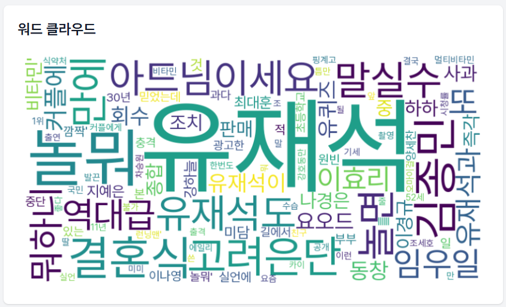

# 네이버 뉴스 크롤러 & 분석기

<div align="center">
  
  
  
  
</div>

## 📝 프로젝트 소개 (Project Introduction)

네이버 뉴스를 크롤링하여 검색어와 관련된 기사를 수집하고, 다양한 데이터 분석 기능을 제공하는 웹 애플리케이션입니다. 수집된 뉴스 기사를 바탕으로 워드 클라우드를 생성하고 감정 분석을 통해 뉴스의 긍정/부정/중립 경향을 시각적으로 보여줍니다.

## ✨ 주요 기능 (Key Features)

- **뉴스 크롤링**: 네이버 뉴스에서 최근 3일간의 기사를 수집
- **워드 클라우드**: 수집된 기사의 키워드를 시각화
- **감정 분석**: 뉴스 기사의 긍정/부정/중립 성향 분석 및 파이 차트로 시각화
- **반응형 디자인**: 모바일과 데스크톱에서 모두 사용 가능한 UI

## 🖼️ 스크린샷 (Screenshots)





## 🛠️ 기술 스택 (Tech Stack)

### 백엔드 (Backend)
- **Python**: 주요 개발 언어
- **Flask**: 웹 프레임워크
- **BeautifulSoup4**: HTML 파싱 및 크롤링
- **WordCloud**: 워드 클라우드 생성
- **VADER Sentiment**: 감정 분석
- **Matplotlib**: 데이터 시각화

### 프론트엔드 (Frontend)
- **HTML/CSS**: 기본 UI 구조
- **JavaScript**: 비동기 요청 처리
- **Tailwind CSS**: 스타일링
- **Pretendard 폰트**: 한글 지원

## 📄 프로젝트 구조 (Project Structure)

```
NewsCrawling/
│
├── app.py                      # Flask 애플리케이션 메인 파일
├── requirements.txt            # 필요한 Python 패키지 목록
├── README.md                   # 프로젝트 설명서
│
├── static/                     # 정적 파일
│   └── js/                     # JavaScript 파일
│       └── script.js           # 프론트엔드 로직
│
├── templates/                  # HTML 템플릿
│   └── index.html              # 메인 페이지
│
├── fonts/                      # 폰트 파일
|   └── Pretendard-Regular.ttf  # 한글 지원 폰트
|
└── sources/                    # 폰트 파일
    ├── mainPage.png            # 메인 페이지 이미지
    ├── newsTitles.png          # 뉴스 제목 목록 이미지
    ├── sentimentPiChart.png    # 감정 분석 결과 이미지
    └── wordCloud.png           # Word Cloud 결과 이미지
```

## 🌟 사용 예시 (Usage Example)

1. 검색창에 키워드를 입력합니다 (예: "유재석", "김수현").
2. "검색하기" 버튼을 클릭하거나 Enter 키를 누릅니다.
3. 검색 결과가 나타나면 다음을 확인할 수 있습니다:
   - 검색된 뉴스 기사 목록
   - 워드 클라우드 시각화
   - 감정 분석 결과 (긍정/부정/중립) 파이 차트

## 📋 향후 계획 (Future Plans)

- [ ] 날짜 범위 지정 기능 추가
- [ ] 다양한 뉴스 소스 지원 (다음, 구글 뉴스 등)
- [ ] 자연어 처리 기능 강화 (주제 모델링, 키워드 추출 등)
- [ ] 사용자 정의 필터 기능 추가
- [ ] 더 세분화된 감정 분석 제공

## 📞 연락처 (Contact)

프로젝트에 관한 질문이나 제안이 있으시면 [이메일](mailto:your-email@example.com) 또는 [GitHub 이슈](https://github.com/your-username/naver-news-crawler/issues)를 통해 연락해주세요.
